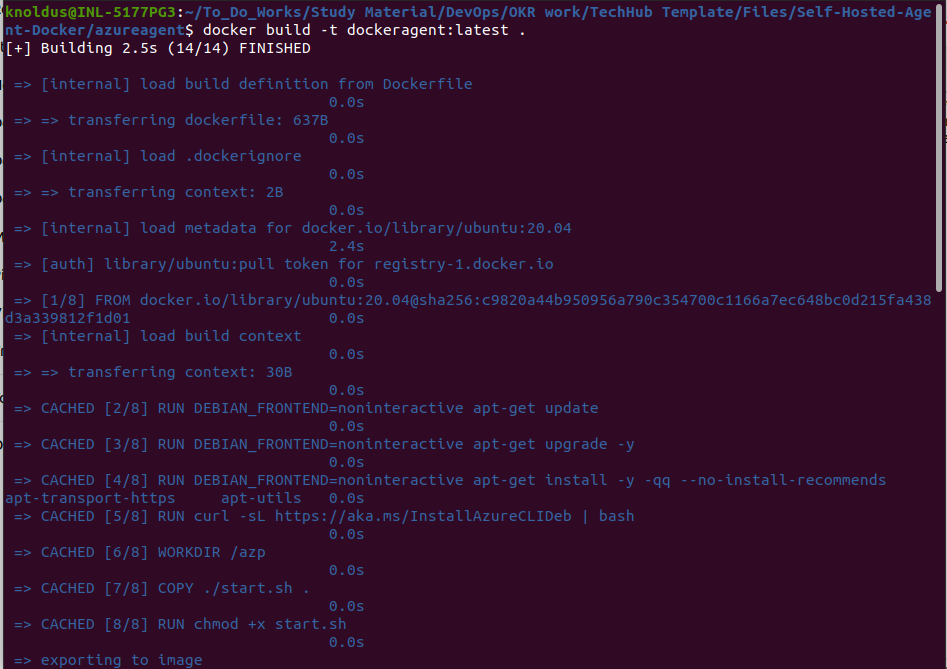
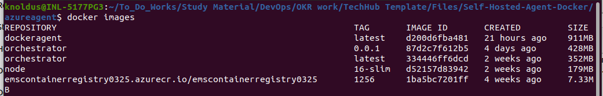
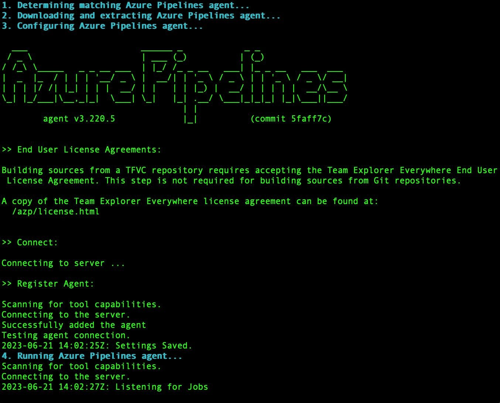
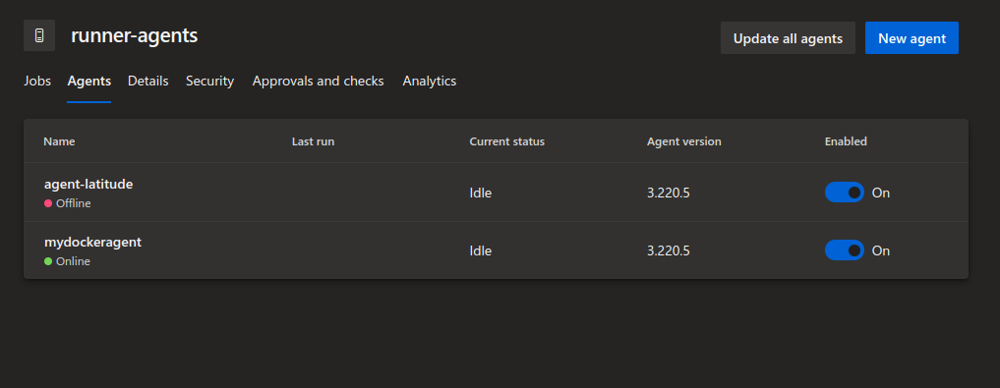

## Description

Here, In this template, we will create the self-hosted agent with the help of a docker file and configure it on our Azure DevOps pool.

---
##### Pre-Requisite

* Docker 
* Azure Account

---
### Steps

* Login into AZ account using `az login` or `az login --tenant <TENANT-ID>`
* Change the permission of the file `chmod a+x script.sh`
* Go to the terminal and run the command `./script.sh` or run the script from any ID like Visual Code or IntelliJ.
* After running this script , it will create the agent inside the pool of Azure DevOps.

---
### Outputs

1. First, we need to build our docker file using :

`docker build -t dockeragent:latest .`

2. Verify if the images is build successfully :

`docker images`

3. To run a container in docker : 

`docker run -e AZP_URL=<your server URL> -e AZP_TOKEN=<PAT_TOKEN> -e AZP_AGENT_NAME=mydockeragent dockeragent:latest`

4. After running the container and configuration been done, check whether the agent is come online or not on ADO portal:

---